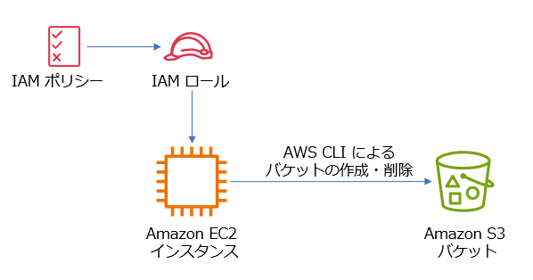

# IAM ロールのワーク

* このワークは、指定された AWS アカウントと IAM ユーザー/パスワードを使用して実施して下さい。
* ワークの環境は、許可されている期限内でのみ利用可能ですのでご了承ください。
---

## ワークの目的

* IAM ロールについて、下記のユースケースをハンズオンで体験します。
    - AWS のリソースが他の AWS リソースへアクセスすることを許可する

---

## AWS のリソースが他の AWS リソースへアクセスすることを許可する

* IAM ロールを使用し、EC2 インスタンスから AWS CLI で Amazon S3 バケットを作成・削除できるようにします。



### 手順

#### ワーク環境の作成

1. AWS マネジメントコンソールにサインインします。

1. コンソールのページの上部で、リージョンとして **東京** を指定して下さい。

1. AWS CloudFormation のページへ移動します。
    * コンソールのページ上部の **検索**　の入力エリアに `cfn` と入力して Enter キーを押します。

1. ページ左側のメニュー（ナビゲーションメニュー）から **スタック** を選択します。

1. ページ右上あたりにある **スタックの作成** から **新しいリソースを使用 (標準)** を選択します。

1. **スタックの作成** で **既存のテンプレートを選択** を選択します。

1. **テンプレートの指定** で **Amazon S3 URL** を選択し、**Amazon S3 URL** で下記を入力します。
    - `https://tnobep-work-public.s3.ap-northeast-1.amazonaws.com/iam-work/iam-role/iam-role-work.yaml`

1. **次へ**　をクリックします。
   
1. **スタック名を提供**　の **スタック名** に `iam-role-work` と入力します。

1. **次へ**　をクリックします。

1. ページを下にスクロールし、**機能**　の **AWS CloudFormation によって IAM リソースがカスタム名で作成される場合があることを承認します。** にチェックします。

1. ページを下にスクロールし、**次へ**　をクリックします。

1. ページを下にスクロールし、**送信**　をクリックします。

1. ナビゲーションメニューから **スタック** を選択します。

1. **iam-role-work** スタックのステータスが **CREATE_COMPLETE** になるまで数分待ちます。
    - 時々、リフレッシュアイコンを選択して表示を更新して下さい。
    - ステータスが **CREATE_COMPLETE** になってから次の手順へすすんでください。

#### EC2 インスタンスに設定された IAM ロールで Amazon S3 バケット作成を試行する

1. Amazon EC2 のページへ移動します。
    * AWS マネジメントコンソールページ上部の **検索**　の入力エリアに `ec2` と入力して Enter キーを押します。

1. **リソース** の **インスタンス(実行中)** のリンクを選択します。

1. **インスタンス** で **myInstance** の左横のチェックボックスをチェックします。

1. ページ下部の **セキュリティ** タブを選択します。

1. IAM ロールに **myInstanceRole** が設定されていることを確認します。

1. ページ上部の **接続** タブを選択します。

1. **セッションマネージャー** タブを選択します。

1. **接続** を選択します。
    - ブラウザで新しいタブが開き、セッションマネージャーのセッションが開始されます。

1. セッションマネージャーで、下記のコマンドを実行します。
    - これにより、AWS CLI 使用時にどの IAM のアイデンティティを使用するかを確認できます。
    - `aws sts get-caller-identity`
    - 下記の例ように、適用されている IAM ロールが表示されていることを確認します。
    -
        ```
        {
            "UserId": "AROAQ1V23XYZXYZXYZXYZ:i-0e9f3de789f495722",
            "Account": "123456789012",
            "Arn": "arn:aws:sts::123456789012:assumed-role/myInstanceRole/i-0e9f3de789f495722"
        }
        ```

1. これから AWS CLI を使用して Amazon S3 バケットの作成を試行します。
    - ユニークなバケット名を決めてください。
    - **大文字とアンダースコアは不可。ハイフンは OK**
    - 例: `tnobep-work-20250101`

1. 下記のコマンド例を参考に Amazon S3 バケットの作成を試行します。
    - `aws s3 mb s3://tnobep-work-20250101`
    - 実行すると、下記のようなエラーが表示され失敗することを確認します。
    - 
        ```
        make_bucket failed: s3://tnobep-work-20250101 An error occurred (AccessDenied) when calling the CreateBucket operation: User: arn:aws:sts::123456789012:assumed-role/myInstanceRole/i-0e9f3de789f495722 is not authorized to perform: s3:CreateBucket on resource: "arn:aws:s3:::tnobep-work-20250101" because no identity-based policy allows the s3:CreateBucket action
        ```

1. 現在 EC2 インスタンスに適用されている IAM ロールでは、ポリシーで許可されていないため、Amazon S3 バケットを作成できないことが確認できました。

1. ブラウザでセッションマネージャーのタブを閉じます。

#### IAM ロールのポリシーの確認

1. EC2 のページで下記を実行して AWS IAM のページに切り替えます。
    - ページ上部の **検索**　の入力エリアに `iam` と入力して Enter キーを押します。

1. ナビゲーションメニューから **ロール** を選択します。

1. ページ上部の **検索**　の入力エリアに `myInstanceRole` と入力します。

1. ロールの一覧から、**myInstanceRole** のリンクを選択します。

1. **信頼関係** タブを選択し、**信頼されたエンティティ** で表示されるポリシーの内容を確認します。
    - これは **信頼ポリシー** です。
    - EC2 というサービスが、ロールを assumeする (引き受ける) ことが許可されていることを確認します。

1. **許可** タブを選択し、**許可ポリシー** で表示されるポリシ名ーを確認します。
    - **AmazonSSMManagedInstanceCore** というポリシーだけが表示されています。
    - ポリシー名の先頭にオレンジ色のキューブのアイコンが表示されています。これはAWS により用意されている管理ポリシーであることを示しています。
    - この AmazonSSMManagedInstanceCore ポリシーは、EC2 インスタンスでセッションマネージャーを使用するために必要になります。
    - この AmazonSSMManagedInstanceCore ポリシーは、AWS CloudFormation で EC2 インスタンスを作成時に設定しています。
    - 他にポリシーはありません。つまり Amazon S3 バケットの作成を許可するポリシーは存在していないことを確認します。


#### IAM ロールにポリシーを追加

1. AWS IAM のナビゲーションメニューから **ポリシー** を選択します。

1. ページ右上あたりにある **ポリシーの作成** を選択します。

1. **ポリシーエディタ** で **JSON** を選択します。

1. 下記の JSON をコピーして **ポリシーエディタ** に貼り付けます。(デフォルトのものを完全に上書きします。）

    -
    ```
    {
        "Version": "2012-10-17",
        "Statement": [
            {
                "Sid": "VisualEditor0",
                "Effect": "Allow",
                "Action": [
                    "s3:CreateBucket",
                    "s3:DeleteBucket"
                ],
                "Resource": "arn:aws:s3:::tnobep-work-20250101"
            }
        ]
    }
    ```

1. 貼り付けた JSON で、`tnobep-work-20250101` の部分を自分で考えたユニークなバケット名に書き換えます。
1. **次へ** を選択します。

1. **ポリシー名** に `my-s3-policy` と入力し、ページ下側にある **ポリシーの作成** を選択します。

1. ナビゲーションメニューから **ロール** を選択します。

1. ロールの一覧から、**myInstanceRole** のリンクを選択します。

1. **許可** タブを選択し、**許可を追加** から **ポリシーをアタッチ** を選択します。

1. **my-s3-policy** のチェックボックスをチェックして、**許可を追加** を選択します。

#### 再び EC2 インスタンスに設定された IAM ロールで Amazon S3 バケット作成を試行する

1. Amazon EC2 のページへ移動します。
    * AWS マネジメントコンソールページ上部の **検索**　の入力エリアに `ec2` と入力して Enter キーを押します。

1. **リソース** の **インスタンス(実行中)** のリンクを選択します。

1. **インスタンス** で **myInstance** の左横のチェックボックスをチェックします。

1. ページ上部の **接続** タブを選択します。

1. **セッションマネージャー** タブを選択します。

1. **接続** を選択します。
    - ブラウザで新しいタブが開き、セッションマネージャーのセッションが開始されます。

1. 下記のコマンド例を参考に Amazon S3 バケットの作成を試行します。**バケット名は自分で考えたユニークなものを指定します。**
    - `aws s3 mb s3://tnobep-work-20250101`
    - 今回はバケット作成が成功して、下記のようなメッセージが出力されます。
    - make_bucket: tnobep-work-20250101

1. 下記のコマンドで、作成されたバケットにファイルをアップロードします。**バケット名は自分で考えたユニークなものを指定します。**
    - `cd`
    - `echo test > test.txt`
    - `aws s3 cp test.txt s3://tnobep-work-20250101`
    - **ただし、これは失敗します。** 追加した許可ポリシーには、s3:PutObject アクションは含まれていないためです。 


1. 下記のコマンドで、作成されたバケットを削除します。**バケット名は自分で考えたユニークなものを指定します。**
    - `aws s3 rb s3://tnobep-work-20250101`
    - バケット削除が成功して、下記のようなメッセージが出力されます。
    - remove_bucket: tnobep-work-20250101

1. 現在 EC2 インスタンスに適用されている IAM ロールで、ポリシーで許可されているため Amazon S3 バケットの作成や削除が行えることが確認できました。

1. ブラウザでセッションマネージャーのタブを閉じます。

#### ワーク環境の削除

1. AWS IAM のナビゲーションメニューから **ポリシー** を選択します。

1. **my-s3-policy** の左横のラジオボタンを選択して **削除**　を選択します。
    - 削除の確認のダイアログで必要な入力を行い、削除を完了します。

1. AWS CloudFormation のページへ移動します。
    * AWS マネジメントコンソールページ上部の **検索**　の入力エリアに `cfn` と入力して Enter キーを押します。

1. **iam-role-work** の左横のラジオボタンを選択して **削除**　を選択します。
    - 削除の確認のダイアログで必要な入力を行い、削除を完了します。

1. スタックの削除が完了し、スタックの一覧に表示されなくなることを確認します。

#### お疲れさまでした。以上でワークは終了です。
